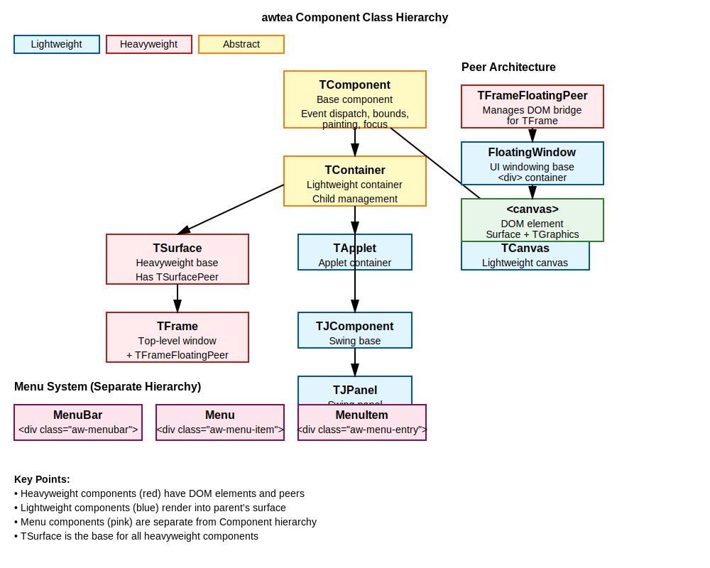
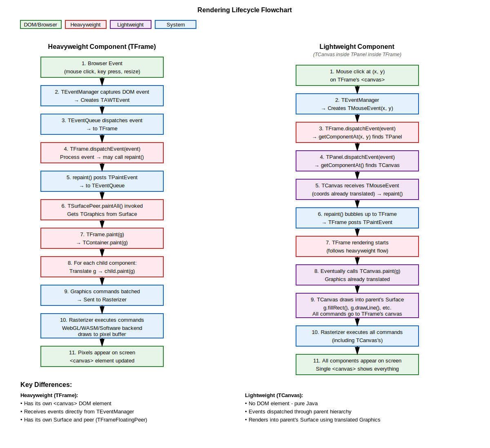

# Component Mapping Strategy: AWT to awtea

## Overview

This document describes how AWT/Swing components are mapped to web technologies in awtea. The architecture distinguishes
between **heavyweight** components (with DOM elements and peers) and **lightweight** components (pure Java rendering).

## Core Concepts

### Heavyweight Components

- Have their own DOM element (usually a `<canvas>`)
- Use a **Peer** class that manages the DOM interaction
- Have their own **Surface** for rendering
- Receive native browser events directly
- Examples: `TFrame`, `Applet`

### Lightweight Components

- No DOM element
- Render into their parent's Surface via `paint(Graphics g)`
- Events are dispatched through the parent hierarchy
- Examples: `TPanel`, `TCanvas`, `TButton`, `TLabel`

### Special Components

- Menu components (`MenuBar`, `Menu`, `MenuItem`) use a separate AWT hierarchy
- Rendered as DOM elements (`<div>`) outside the normal Component tree
- Not part of the `Component` class hierarchy in AWT

## Component Mapping Table

### Core AWT Components

| AWT Class    | Weight          | awtea Class               | Peer / DOM Mapping                                         | Notes                                                  |
|--------------|-----------------|---------------------------|------------------------------------------------------------|--------------------------------------------------------|
| `Frame`      | **Heavyweight** | `TFrame`                  | `TFrameFloatingPeer` → `FloatingWindow` + `<canvas>`       | Top-level decorated window with title bar and controls |
| `Window`     | **Heavyweight** | _Not yet implemented_     | Planned: `TAWTWindowPeer` → `FloatingWindow` (undecorated) | Top-level window without decorations (Issue #18)       |
| `Dialog`     | **Heavyweight** | _Not yet implemented_     | Planned: `TDialogFloatingPeer` → `FloatingWindow`          | Modal/non-modal dialog window (Issue #18)              |
| `Applet`     | **Heavyweight** | `TApplet`                 | `AppletWindow` → `FloatingWindow` + `<canvas>`             | Browser-embedded application window                    |
| `Panel`      | **Lightweight** | _Implicit via TContainer_ | ❌ None                                                     | Pure Java container, renders to parent                 |
| `Container`  | **Lightweight** | `TContainer`              | ❌ None                                                     | Base container class for organizing components         |
| `Component`  | **Lightweight** | `TComponent`              | ❌ None                                                     | Base class for all UI components                       |
| `Canvas`     | **Lightweight** | `TCanvas`                 | ❌ None                                                     | Drawable area, renders to parent's surface             |
| `Button`     | **Lightweight** | _Not yet implemented_     | ❌ None                                                     | Clickable button drawn via graphics primitives         |
| `Label`      | **Lightweight** | _Not yet implemented_     | ❌ None                                                     | Static text rendered via `drawString()`                |
| `TextField`  | **Hybrid**      | _Not yet implemented_     | ⚠️ Possible `<input>` overlay                              | May use DOM overlay for native keyboard/accessibility  |
| `TextArea`   | **Hybrid**      | _Not yet implemented_     | ⚠️ Possible `<textarea>` overlay                           | May use DOM overlay for native text editing            |
| `Checkbox`   | **Lightweight** | _Not yet implemented_     | ❌ None                                                     | Checkbox drawn via graphics primitives                 |
| `List`       | **Lightweight** | _Not yet implemented_     | ❌ None                                                     | Scrollable list component                              |
| `Choice`     | **Lightweight** | _Not yet implemented_     | ❌ None                                                     | Drop-down choice/combo box                             |
| `Scrollbar`  | **Lightweight** | _Not yet implemented_     | ❌ None                                                     | Scrollbar control                                      |
| `ScrollPane` | **Lightweight** | _Not yet implemented_     | ❌ None                                                     | Container with scrollbars                              |

### Swing Components

| Swing Class  | Weight          | awtea Class           | Peer / DOM Mapping    | Notes                                 |
|--------------|-----------------|-----------------------|-----------------------|---------------------------------------|
| `JComponent` | **Lightweight** | `TJComponent`         | ❌ None                | Base class for Swing components       |
| `JPanel`     | **Lightweight** | `TJPanel`             | ❌ None                | Swing container with double buffering |
| `JFrame`     | **Heavyweight** | _Not yet implemented_ | Would extend `TFrame` | Top-level Swing window                |
| `JButton`    | **Lightweight** | _Not yet implemented_ | ❌ None                | Swing button with look and feel       |
| `JLabel`     | **Lightweight** | _Not yet implemented_ | ❌ None                | Swing text/icon label                 |

### awtea Internal Classes

| Class            | Weight          | DOM Mapping                    | Purpose                                                    |
|------------------|-----------------|--------------------------------|------------------------------------------------------------|
| `TSurface`       | **Heavyweight** | Abstract base + `TSurfacePeer` | Base class for components with their own rendering surface |
| `THeavyCanvas`   | **Heavyweight** | `HTMLCanvasElement` + Surface  | Heavyweight canvas with own DOM element and rendering backend, used by peers |
| `FloatingWindow` | N/A             | `<div>` positioned container   | Base UI class for windowing system (Issue #18)             |
| `AppletWindow`   | N/A             | `<div>` with `<canvas>`        | Applet container window                                    |

### Menu Components (Separate Hierarchy)

Menu components in AWT/Swing are **not** part of the `Component` hierarchy. They extend `MenuComponent` instead.

| AWT MenuComponent  | Weight      | awtea Class            | DOM Mapping                             | Notes                                |
|--------------------|-------------|------------------------|-----------------------------------------|--------------------------------------|
| `MenuBar`          | **Special** | `MenuBar`              | `<div class="aw-menubar">`              | Horizontal menu bar at top of window |
| `Menu`             | **Special** | `MenuHandle` interface | `<div class="aw-menu-item">` + dropdown | Top-level menu with dropdown items   |
| `MenuItem`         | **Special** | Menu entry             | `<div class="aw-menu-entry">`           | Individual menu action item          |
| `CheckboxMenuItem` | **Special** | _Not yet implemented_  | Planned                                 | Menu item with checkbox state        |
| `PopupMenu`        | **Special** | _Not yet implemented_  | Planned                                 | Context menu (right-click menu)      |

## Architecture Diagrams

### Class Hierarchy



**Text representation:**

```
java.awt.Component (AWT API)
├─ TComponent (awtea base implementation)
   ├─ TCanvas (lightweight drawable area)
   ├─ TContainer (lightweight container)
   │  ├─ TApplet (actually lightweight in implementation)
   │  ├─ TSurface (heavyweight base with peer)
   │  │  └─ TFrame (heavyweight window)
   │  ├─ TJComponent (Swing base)
   │  │  └─ TJPanel (Swing panel)
   │  └─ (future: Panel, ScrollPane, etc.)
   └─ (future: Button, Label, TextField, etc.)

MenuComponent (separate AWT hierarchy)
├─ MenuBar
├─ MenuItem
└─ Menu (extends MenuItem)
```

### Peer Architecture

```
┌────────────────────────────────────────────┐
│           TFrame (TSurface)                │
│  ┌──────────────────────────────────────┐  │
│  │     TFrameFloatingPeer               │  │
│  │  ┌────────────────────────────────┐  │  │
│  │  │      FloatingWindow            │  │  │
│  │  │  ┌──────────────────────────┐  │  │  │
│  │  │  │   <canvas> element       │  │  │  │
│  │  │  │   (Surface + TGraphics)  │  │  │  │
│  │  │  └──────────────────────────┘  │  │  │
│  │  └────────────────────────────────┘  │  │
│  └──────────────────────────────────────┘  │
│                                            │
│     paint()                                │
│     ↓                                      │
│  ┌──────────────────────────────────────┐  │
│  │  Lightweight children render here    │  │
│  │  (TPanel, TCanvas, etc.)             │  │
│  └──────────────────────────────────────┘  │
└────────────────────────────────────────────┘
```

## Rendering Lifecycle



### Heavyweight Component (TFrame)

```
┌─────────────────────────────────────────────────────────┐
│ 1. Browser Event (mouse, keyboard, resize)             │
└────────────────────┬────────────────────────────────────┘
                     ↓
┌─────────────────────────────────────────────────────────┐
│ 2. TEventManager captures DOM event                     │
│    → Creates TAWTEvent (TMouseEvent, TKeyEvent, etc.)  │
└────────────────────┬────────────────────────────────────┘
                     ↓
┌─────────────────────────────────────────────────────────┐
│ 3. TEventQueue dispatches event to TFrame               │
└────────────────────┬────────────────────────────────────┘
                     ↓
┌─────────────────────────────────────────────────────────┐
│ 4. TFrame processes event → may call repaint()          │
└────────────────────┬────────────────────────────────────┘
                     ↓
┌─────────────────────────────────────────────────────────┐
│ 5. repaint() posts TPaintEvent to TEventQueue           │
└────────────────────┬────────────────────────────────────┘
                     ↓
┌─────────────────────────────────────────────────────────┐
│ 6. TSurfacePeer.paintAll() invoked                      │
│    → Gets TGraphics from Surface                        │
│    → Calls TFrame.paint(g)                              │
└────────────────────┬────────────────────────────────────┘
                     ↓
┌─────────────────────────────────────────────────────────┐
│ 7. TFrame.paint(g) → TContainer.paint(g)                │
│    → Translates and calls child.paint(g) for each child │
└────────────────────┬────────────────────────────────────┘
                     ↓
┌─────────────────────────────────────────────────────────┐
│ 8. Graphics commands batched and sent to Rasterizer     │
│    → WebGL/WASM/Software backend executes commands      │
└────────────────────┬────────────────────────────────────┘
                     ↓
┌─────────────────────────────────────────────────────────┐
│ 9. Pixels appear on <canvas> element in browser         │
└─────────────────────────────────────────────────────────┘
```

### Lightweight Component (TCanvas in TPanel in TFrame)

```
┌─────────────────────────────────────────────────────────┐
│ 1. Mouse click at (x, y) on TFrame's <canvas>          │
└────────────────────┬────────────────────────────────────┘
                     ↓
┌─────────────────────────────────────────────────────────┐
│ 2. TEventManager → TMouseEvent(x, y)                    │
└────────────────────┬────────────────────────────────────┘
                     ↓
┌─────────────────────────────────────────────────────────┐
│ 3. TFrame.dispatchEvent(event)                          │
│    → TContainer.getComponentAt(x, y) finds TCanvas      │
└────────────────────┬────────────────────────────────────┘
                     ↓
┌─────────────────────────────────────────────────────────┐
│ 4. TCanvas receives TMouseEvent                         │
│    → Processes event, may call repaint()                │
└────────────────────┬────────────────────────────────────┘
                     ↓
┌─────────────────────────────────────────────────────────┐
│ 5. TCanvas.repaint() bubbles up to TFrame               │
│    → TFrame posts TPaintEvent to queue                  │
└────────────────────┬────────────────────────────────────┘
                     ↓
┌─────────────────────────────────────────────────────────┐
│ 6. TFrame rendering starts (see heavyweight flow)       │
│    → Eventually calls TCanvas.paint(g)                  │
│    → Graphics already translated to TCanvas coordinates │
└────────────────────┬────────────────────────────────────┘
                     ↓
┌─────────────────────────────────────────────────────────┐
│ 7. TCanvas draws into parent's Surface                  │
│    → All rendering commands go to TFrame's <canvas>     │
└─────────────────────────────────────────────────────────┘
```

## Key Implementation Details

### Surface and Peer System

Heavyweight components use the **Surface/Peer** pattern:

1. **TSurface**: Abstract base class that owns a `TSurfacePeer`
2. **TSurfacePeer**: Manages double-buffering and coordinates painting
3. **Peer (e.g., TFrameFloatingPeer)**: Bridges Java component to DOM
    - Extends `FloatingWindow` (UI class)
    - Creates and manages `<canvas>` element
    - Sets up `TEventManager` for DOM event capture
    - Provides `TGraphics` context backed by Surface

### Event Dispatch

#### For Heavyweight Components:

```java
Browser Event →TEventManager →TAWTEvent →TEventQueue 
→ TFrame.

dispatchEvent() →
Event handlers
```

#### For Lightweight Components:

```java
Browser Event →TEventManager →TAWTEvent →TEventQueue
→ TFrame.

dispatchEvent() → TContainer.

getComponentAt(x, y)
→ TCanvas.

dispatchEvent() →
Event handlers
```

### Focus Management

- `TFocusManager`: Global focus tracking
- Focus events (gained/lost) dispatched to components
- Only focusable components can receive keyboard events
- Focus traversal follows component hierarchy

### Painting and Graphics

All rendering goes through the **command pattern**:

1. Application calls drawing methods: `g.fillRect()`, `g.drawString()`, etc.
2. `TGraphics` records operations as `SurfaceCommand` objects
3. Commands batched and sent to `Rasterizer`
4. Backend executes commands:
    - **WebGL**: For screen surfaces (hardware-accelerated)
    - **WASM**: For offscreen surfaces (high performance)
    - **Software**: Java fallback (compatibility)

See [RENDERING_BACKENDS.md](RENDERING_BACKENDS.md) for details.

### Menu System

Menus are handled separately from the Component system:

- **MenuBar**: Attached to `FloatingWindow` instances
- Rendered as `<div>` elements with CSS styling
- Action handlers registered via `clickHandlers` map
- Not part of the painting/graphics system
- Example in Kitchen Sink demo (see `FloatingWindow.setMenuBar()`)

## Examples

### Creating a Heavyweight Window

```java
// TFrame is heavyweight - creates its own window and canvas
TFrame frame = new TFrame();
frame.

setTitle("My Application");
frame.

setSize(800,600);
frame.

setVisible(true);

// Add lightweight components
TCanvas canvas = new TCanvas() {
    @Override
    public void paint(TGraphics g) {
        g.setColor(Color.RED);
        g.fillRect(10, 10, 100, 100);
    }
};
frame.

add(canvas);
```

### Event Handling

```java
// Heavyweight component receives events directly
frame.addMouseListener(new TMouseAdapter() {
    @Override
    public void mouseClicked (TMouseEvent e){
        System.out.println("Frame clicked at: " + e.getX() + ", " + e.getY());
    }
});

// Lightweight component receives events from parent
        canvas.

addMouseListener(new TMouseAdapter() {
    @Override
    public void mouseClicked (TMouseEvent e){
        // Coordinates already translated to canvas space
        System.out.println("Canvas clicked at: " + e.getX() + ", " + e.getY());
        repaint();
    }
});
```

### Menu Bar Example

```java
MenuBar menuBar = new MenuBar(frame::schedule);

MenuHandle fileMenu = menuBar.createMenu("File");
fileMenu.

createEntry("Open",() ->{
        System.out.

println("Open clicked");
});
        fileMenu.

createEntry("Save",() ->{
        System.out.

println("Save clicked");
});
        fileMenu.

createSeparator();
fileMenu.

createEntry("Exit",() ->{
        System.

exit(0);
});

        frame.

setMenuBar(menuBar);
```

## Guidelines for Developers

### When to Create Heavyweight Components

Create a heavyweight component (extending `TSurface` with a Peer) when:

1. You need a **top-level window** (Frame, Dialog, Window)
2. You need **direct browser event capture** for performance
3. You want **separate z-ordering** from other windows
4. You need **native browser features** (e.g., modality, fullscreen)

### When to Create Lightweight Components

Create a lightweight component (extending `TComponent` or `TContainer`) when:

1. You need a **child component** inside a container
2. You want **efficient rendering** (no DOM overhead)
3. You need **custom painting** behavior
4. You're implementing **standard AWT widgets** (Button, Label, etc.)

### Hybrid Components (Future)

For text input components, consider a hybrid approach:

- Render visually as lightweight (drawn graphics)
- Overlay a hidden/transparent `<input>` or `<textarea>` for:
    - Native mobile keyboard
    - Copy/paste functionality
    - Screen reader accessibility
    - IME support (international text input)

## Related Documentation

- [CANVAS_COMPONENTS.md](CANVAS_COMPONENTS.md) - Detailed guide on TCanvas vs THeavyCanvas with examples
- [RENDERING_BACKENDS.md](RENDERING_BACKENDS.md) - Details on WebGL/WASM/Software rendering

## Key Source Files

### Core Components

- [`TComponent.java`](../awtea-classlib/src/main/java/me/mdbell/awtea/classlib/java/awt/TComponent.java) - Base
  component
- [`TContainer.java`](../awtea-classlib/src/main/java/me/mdbell/awtea/classlib/java/awt/TContainer.java) - Container
  base
- [`TCanvas.java`](../awtea-classlib/src/main/java/me/mdbell/awtea/classlib/java/awt/TCanvas.java) - Lightweight canvas
- [`TSurface.java`](../awtea-classlib/src/main/java/me/mdbell/awtea/classlib/java/awt/TSurface.java) - Heavyweight base
- [`TFrame.java`](../awtea-classlib/src/main/java/me/mdbell/awtea/classlib/java/awt/TFrame.java) - Frame window
- [`TApplet.java`](../awtea-classlib/src/main/java/me/mdbell/awtea/classlib/java/applet/TApplet.java) - Applet container

### Peers

- [
  `TFrameFloatingPeer.java`](../awtea-classlib/src/main/java/me/mdbell/awtea/classlib/java/awt/awtea/peer/TFrameFloatingPeer.java) -
  Frame peer
- [
  `TSurfacePeer.java`](../awtea-classlib/src/main/java/me/mdbell/awtea/classlib/java/awt/awtea/peer/TSurfacePeer.java) -
  Surface peer base

### UI System

- [`FloatingWindow.java`](../awtea-ui/src/main/java/me/mdbell/awtea/ui/FloatingWindow.java) - Windowing system base
- [`AppletWindow.java`](../awtea-ui/src/main/java/me/mdbell/awtea/ui/AppletWindow.java) - Applet window
- [`MenuBar.java`](../awtea-ui/src/main/java/me/mdbell/awtea/ui/MenuBar.java) - Menu system

### Events

- [`TEventQueue.java`](../awtea-classlib/src/main/java/me/mdbell/awtea/classlib/java/awt/TEventQueue.java) - Event queue
- [`TEventManager.java`](../awtea-classlib/src/main/java/me/mdbell/awtea/classlib/java/awt/awtea/TEventManager.java) -
  DOM event capture

### Graphics

- [`TGraphics.java`](../awtea-classlib/src/main/java/me/mdbell/awtea/classlib/java/awt/TGraphics.java) - Graphics
  context
- [`Surface.java`](../awtea-graphics/src/main/java/me/mdbell/awtea/gfx/Surface.java) - Surface interface
- [`Rasterizer.java`](../awtea-graphics/src/main/java/me/mdbell/awtea/gfx/Rasterizer.java) - Rendering backend
